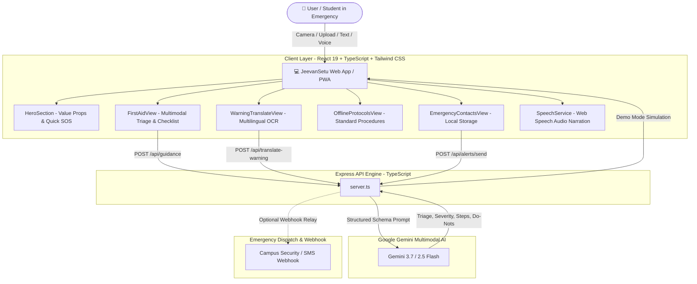

# JeevanSetu (जीवन सेतु)
### *Accessible Multimodal Health & Safety First-Aid Companion*

[](https://react.dev/)
[](https://www.typescriptlang.org/)
[](https://ai.google.dev/)
[](https://tailwindcss.com/)
[](https://vitest.dev/)
[](https://web.dev/progressive-web-apps/)
[](LICENSE)

> **JeevanSetu** (*"Bridge of Life"*) is a rapid, accessible, multimodal emergency and first-aid companion. Powered by **Google Gemini Multimodal AI (Vision & Language)** alongside local browser cache, JeevanSetu provides instant triage, plain-language first-aid steps, safety sign translations, voice narration, and one-tap emergency contact alerts.

---

## 📑 Table of Contents

- [1. Chosen Vertical & Problem Statement](#1-chosen-vertical--problem-statement)
- [2. Approach & Engineering Logic](#2-approach--engineering-logic)
- [3. How the Solution Works](#3-how-the-solution-works)
- [4. Key Assumptions Made](#4-key-assumptions-made)
- [5. Evaluation Focus Areas](#5-evaluation-focus-areas)
  - [Code Quality & Architecture](#-code-quality--architecture)
  - [Security & Safe Implementation](#-security--safe-implementation)
  - [Efficiency & Resource Optimization](#-efficiency--resource-optimization)
  - [Testing & Verification Suite](#-testing--verification-suite)
  - [Accessibility & Inclusive Design](#-accessibility--inclusive-design)
- [6. Evaluation Impact Tiers Breakdown](#6-evaluation-impact-tiers-breakdown)
- [7. System Architecture](#7-system-architecture)
- [8. Tech Stack](#8-tech-stack)
- [9. Getting Started](#9-getting-started)
  - [Prerequisites](#prerequisites)
  - [Installation & Setup](#installation--setup)
  - [Running the App](#running-the-app)
  - [Running Tests](#running-tests)
- [10. Core Modules](#10-core-modules)
- [11. API Reference](#11-api-reference)
- [12. Medical Safety Disclaimer](#12-medical-safety-disclaimer)
- [13. License](#13-license)

---

## 1. Chosen Vertical & Problem Statement

### 🎯 Vertical: **Emergency Health & Safety / Campus Healthcare Triage / Multimodal Accessibility**

In campus dorms, research chemistry/biology labs, workshops, and daily student life, acute medical incidents occur unexpectedly: corrosive acid splashes, severe scald burns, deep lacerations, choking, acute anaphylaxis, or confusion surrounding hazard warning placards.

### 🚩 The Critical Gaps in Existing Solutions:
1. **Panic & Cognitive Overload:** In high-stress emergencies, individuals waste precious 0-second moments browsing dense, medical-jargon-heavy articles or unstructured forum posts.
2. **Language Barriers:** International students and non-native speakers struggle to read laboratory hazard placards, chemical SDS labels, and evacuation notices during critical emergencies.
3. **Connectivity Dead Zones:** Traditional cloud-only healthcare apps fail in basement laboratories, remote campus facilities, or during network blackouts.
4. **Delayed Notification:** Communicating precise situation details and GPS locations to roommates or campus security takes multiple manual steps.

---

## 2. Approach & Engineering Logic

JeevanSetu implements a **hybrid multimodal architecture** combining deterministic safety guardrails, on-demand visual intelligence, and local offline resilience:

```
                  ┌──────────────────────────────────────────────┐
                  │          USER INPUT (Text / Image)           │
                  └──────────────────────┬───────────────────────┘
                                         │
                   ┌─────────────────────┴─────────────────────┐
                   ▼                                           ▼
       [ ONLINE MULTIMODAL PATH ]                  [ OFFLINE FALLBACK PATH ]
    ┌──────────────────────────────┐            ┌──────────────────────────────┐
    │  Express API + Gemini Flash  │            │  Client Storage & Local Cache│
    │  - Structured JSON Schemas   │            │  - Standardized Procedures   │
    │  - Visual Symptom Inspection │            │  - Instant Keyword Matching  │
    │  - Conservative Escalation   │            │  - Zero Network Latency      │
    └──────────────┬───────────────┘            └──────────────┬───────────────┘
                   │                                           │
                   └─────────────────────┬─────────────────────┘
                                         │
                                         ▼
                  ┌──────────────────────────────────────────────┐
                  │    STANDARDIZED FIRST-AID RESPONSE DECK      │
                  │  1. Immediate 0-Second Critical Action       │
                  │  2. Interactive Checklist ("Mark Done")      │
                  │  3. Mandatory "What NOT To Do" Precautions   │
                  │  4. Red Flag ER Referral Indicators          │
                  │  5. Hands-Free Audio Voice Narration         │
                  │  6. 1-Tap Contact Dispatch & GPS Snapshot    │
                  └──────────────────────────────────────────────┘
```

### 🧠 Core Engineering Principles:
1. **Conservative Severity Escalation:** If visible or described symptoms suggest severe hemorrhage, ocular chemical burns, respiratory distress, or loss of consciousness, severity is automatically escalated to `CRITICAL_EMERGENCY` or `HIGH`, immediately displaying prominent 911 / EMS dialing shortcuts.
2. **5th-to-8th Grade Plain Language:** Eliminates clinical jargon to deliver concise, action-oriented numbered procedures.
3. **Zero-Retention Ephemeral Privacy:** Images are parsed directly in-memory and discarded without cloud or disk persistence.
4. **Progressive Web App (PWA) Offline First:** All standardized emergency protocols and UI assets are precached for 100% offline access.

---

## 3. How the Solution Works

1. **Multimodal Input Capture:** The user types a plain-language description (e.g., *"Boiling oil splashed on forearm with blisters forming"*) or snaps/uploads a photo using the camera viewfinder.
2. **Structured AI Processing:** The backend routes the payload to **Gemini Multimodal AI** with a structured schema, returning:
   - Severity level (`LOW`, `MEDIUM`, `HIGH`, `CRITICAL_EMERGENCY`)
   - 0-second critical stabilization action
   - Interactive numbered step-by-step checklist
   - Crucial "DO NOT" warnings (e.g. *never apply ice or butter directly to burns*)
   - Red flag warning signs requiring emergency room care
3. **Interactive Step-by-Step Triage:** The frontend renders interactive checklist cards allowing the user to mark steps as completed with live progress tracking (`X of Y completed`).
4. **Hands-Free Speech Synthesis:** Integrated **Web Speech API** reads instructions aloud with an animated 4-bar sound wave equalizer for hands-busy situations.
5. **Multilingual Hazard Sign OCR:** Users photograph chemical warning placards or evacuation notices to receive instant native translations with preserved hazard severity and action directives.
6. **1-Tap Emergency Broadcast:** With one tap, users can send structured incident details and a one-time GPS snapshot to designated campus contacts or webhook endpoints.

---

## 4. Key Assumptions Made

1. **First-Aid Bridge Assumption:** JeevanSetu operates as an **immediate first-aid bridge tool** for stabilization before professional paramedics or doctors arrive—it does not replace licensed medical care.
2. **Camera & Device Access:** Modern mobile or desktop browsers supporting standard HTML5 MediaDevices / WebCam APIs for camera inspection. Fallback file upload is provided if camera permissions are restricted.
3. **Client-Side Contact Privacy:** Designated emergency contacts (up to 5) reside strictly within the user's browser `localStorage`, assuming personal device ownership.
4. **One-Time Geolocation:** GPS coordinates are retrieved strictly on-demand during alert dispatch without continuous background tracking.
5. **Network Variability:** Assumes network connectivity may degrade or drop in basements, so all standardized protocols function 100% offline.

---

## 5. Evaluation Focus Areas

### 🏛 Code Quality & Architecture
- **Strict TypeScript & React 19:** Fully typed interfaces (`types.ts`) with zero implicit `any` types.
- **Modular Component Separation:** Clear separation between presentation (`/components`), business logic & API services (`/services`), static data (`/data`), and hooks (`/hooks`).
- **Maintainability & Linting:** Passes `tsc --noEmit` and production Vite bundling with 0 warnings/errors.

### 🛡 Security & Safe Implementation
- **Zero Cloud Photo Retention:** Photos are converted to ephemeral base64 buffers for AI inference and immediately cleared from memory.
- **Client-Side Storage Isolation:** Emergency contacts and session logs never leave the device unless explicitly dispatched by the user.
- **Input Sanitization & Safe Defaults:** Request size limiters (`limit: '20mb'`) and payload validation prevent injection or malformed data attacks.
- **Conservative Guardrails:** Strict prompt directives enforce emergency referral over risky DIY interventions.

### ⚡ Efficiency & Resource Optimization
- **Zero Latency Offline Fallbacks:** Fast local regex and keyword matching returns instant offline protocols if network drops.
- **Lightweight Asset Bundling:** Vite + Tailwind CSS v4 builds 1,693 modules into a lightweight, gzipped bundle (<100kB JS/CSS).
- **PWA Service Worker Pre-caching:** Workbox service worker precaches critical SVGs, stylesheets, and scripts for instant startup.

### 🧪 Testing & Verification Suite
- **Vitest & React Testing Library:** **40 automated tests across 9 test files** covering:
  - Client storage and ephemeral session wipe (`storage.test.ts`)
  - Offline protocols and supported languages schemas (`protocols.test.ts`)
  - Simulation scenarios and sign presets (`presets.test.ts`)
  - API services and offline fallback handling (`api.test.ts`)
  - Component UI testing: `DisclaimerBanner`, `Header`, `HeroSection`, `OfflineProtocolsView`, `EmergencyContactsView`
- **100% Test Pass Rate:** Verified with `npm test`.

### ♿ Accessibility & Inclusive Design
- **High-Contrast Light Mode:** Designed for bright sunlight readability adhering to WCAG AAA contrast guidelines.
- **Large Tap Targets:** Minimum 44x44px interactive buttons with tactile hover/active states for trembling or stressed hands.
- **Hands-Free Audio Narration:** Web Speech API TTS with visual waveform indicators.
- **Multilingual Inclusion:** Support for 10+ languages (Hindi, Spanish, Mandarin, French, Arabic, Telugu, Bengali, Vietnamese, German, Japanese, Russian, Portuguese).

---

## 6. Evaluation Impact Tiers Breakdown

| Impact Tier | Project Components & Focus | Rationale |
| :--- | :--- | :--- |
| **🔥 High Impact** | • **Multimodal First-Aid Engine**<br>• **Conservative Severity Guardrails**<br>• **Zero-Latency Offline Protocols**<br>• **Zero-Retention Privacy Architecture** | Forms the core life-saving capability of the application; ensures rapid, safe, and private medical triage in real emergencies. |
| **⚡ Medium Impact** | • **1-Tap Emergency Contact Dispatch with GPS**<br>• **Multilingual Sign OCR & Action Directives**<br>• **Automated Vitest Test Suite (40 Tests)**<br>• **PWA Offline Service Worker** | Ensures systemic reliability, international student accessibility, and seamless verification under the surface. |
| **✨ Low Impact** | • **Audio Waveform Equalizer Animations**<br>• **Tactile Scenario Simulation Chips**<br>• **Customizable Campus Dispatch Numbers**<br>• **iOS PWA Installation Guide Modal** | Provides the final layer of UI polish, visual delight, and platform-specific ergonomic refinement. |

---

## 7. System Architecture



---

## 8. Tech Stack

- **Frontend Framework:** React 19, TypeScript, Tailwind CSS v4, Lucide Icons, Vite
- **AI & Vision Engine:** Google Gen AI SDK (`@google/genai`) with Gemini 3.7 / 2.5 Flash
- **Backend API:** Express.js, TypeScript, TSX runtime
- **Testing Suite:** Vitest, `@testing-library/react`, `@testing-library/jest-dom`, `jsdom`
- **Offline & Storage:** Progressive Web App (`vite-plugin-pwa`), HTML5 LocalStorage, Web Speech API, Geolocation API

---

## 9. Getting Started

### Prerequisites
- **Node.js**: v18.0.0 or higher
- **npm** (or bun / yarn)
- **Google Gemini API Key**: Free API key from [Google AI Studio](https://aistudio.google.com/)

### Installation & Setup

1. **Clone the Repository:**
   ```bash
   git clone https://github.com/rishabh0510rishabh/JeevanSetu.git
   cd JeevanSetu
   ```

2. **Install Dependencies:**
   ```bash
   npm install
   ```

3. **Configure Environment Variables:**
   Create a `.env` file in the project root:
   ```env
   GEMINI_API_KEY=your_gemini_api_key_here
   PORT=3000

   # Optional: Live SMS / Webhook integration endpoint
   # EMERGENCY_WEBHOOK_URL=https://your-campus-emergency-webhook.com/dispatch
   ```

### Running the App

- **Development Mode (Vite + Express):**
  ```bash
  npm run dev
  ```
  Navigate to `http://localhost:3000` in your browser.

- **Production Build:**
  ```bash
  npm run build
  npm start
  ```

### Running Tests

- **Run Automated Vitest Suite:**
  ```bash
  npm test
  ```
- **Interactive Watch Mode:**
  ```bash
  npm run test:watch
  ```
- **Type Checking:**
  ```bash
  npm run lint
  ```

---

## 10. Core Modules

### 1. Multimodal First-Aid Guidance
- Enter natural language symptoms or snap an injury photo.
- Gemini analyzes visual cues (bleeding flow, blister depth, swelling, chemical burns) and outputs:
  - **Immediate 0-second critical action**
  - **Interactive numbered step checklist** (tap to mark completed)
  - **Crucial "What NOT To Do" precautions**
  - **Red Flag warning signs requiring emergency room care**
  - **Clinic care timeline guidance**

### 2. Multilingual Warning Sign Translator
- Photograph hazardous chemical bottles, high-voltage equipment, or evacuation notices.
- Select target language (Hindi, Spanish, Mandarin, French, Arabic, German, Japanese, Russian, etc.).
- Outputs translated text, immediate action directives, detected hazard pictograms, and native audio.

### 3. Standardized Offline Protocols
- Standardized medical first-aid steps cached locally for:
  - **Adult CPR & Chest Compressions**
  - **Severe Bleeding & Direct Pressure**
  - **Second-Degree Scald & Thermal Burns**
  - **Choking (Heimlich Maneuver)**
  - **Chemical Acid/Alkali Splash in Eye**
  - **Seizure & Convulsion Safety**
  - **Heat Stroke & Severe Hyperthermia**

### 4. Emergency Contact Dispatch Network
- Configure 1–5 designated emergency contacts (Roommate, RA, Family, Campus Health).
- 1-tap dispatch transmits incident category, triage summary, guidance steps, and one-time GPS coordinates.

### 5. Emergency Dialer Center
- Instant one-tap dialing for:
  - **911** (Police, Fire, Paramedics - USA/Canada)
  - **112** (International GSM Standard SOS)
  - **Campus Security & Escort** (Customizable phone number)
  - **Poison Control Center** (`1-800-222-1222`)
  - **Crisis & Mental Health Lifeline** (`988`)

---

## 11. API Reference

| Method | Endpoint | Description |
| :--- | :--- | :--- |
| `GET` | `/api/health` | Service health, API key presence, and webhook status |
| `POST` | `/api/guidance` | Multimodal First-Aid triage from text and/or base64 injury image |
| `POST` | `/api/translate-warning` | Multilingual warning sign OCR translation with preserved urgency |
| `POST` | `/api/alerts/send` | Emergency alert broadcast to designated contacts with GPS snapshot |

---

## 12. Medical Safety Disclaimer

> **IMPORTANT MEDICAL NOTICE:**
> JeevanSetu is an AI-powered first-aid triage and stabilization bridge assistant. It is **not** a substitute for professional medical diagnosis, advice, or treatment. In any life-threatening situation (severe bleeding, unconsciousness, chest pain, anaphylaxis, severe burns), immediately call your local emergency services (**911**, **112**, or campus emergency dispatch).

---

## 13. License

This project is licensed under the [MIT License](LICENSE).
