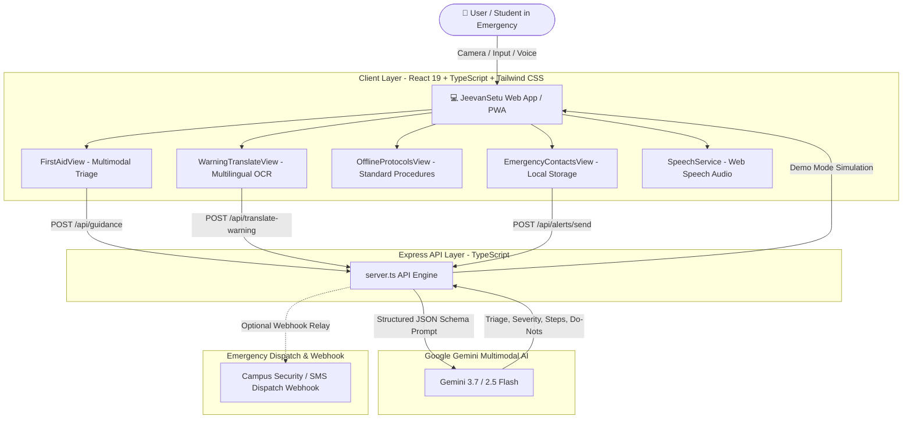

# JeevanSetu (जीवन सेतु)
### *Accessible Multimodal Health & Safety First-Aid Companion*

[](https://react.dev/)
[](https://www.typescriptlang.org/)
[](https://ai.google.dev/)
[](https://tailwindcss.com/)
[](https://web.dev/progressive-web-apps/)
[](LICENSE)

> **JeevanSetu** (*"Bridge of Life"*) is a rapid, accessible, multimodal emergency and first-aid companion. It leverages **Google Gemini Multimodal AI (Vision & Language)** alongside local browser cache to empower students, campus staff, and individuals with instant triage, plain-language first-aid steps, safety sign translations, audio narration, and one-tap emergency contact alerts.

---

## 📑 Table of Contents

- [Key Features](#-key-features)
- [System Architecture](#-system-architecture)
- [Tech Stack](#-tech-stack)
- [Getting Started](#-getting-started)
  - [Prerequisites](#prerequisites)
  - [Installation & Setup](#installation--setup)
  - [Environment Variables](#environment-variables)
  - [Running the App](#running-the-app)
- [Core Modules](#-core-modules)
  - [1. Multimodal First-Aid Guidance](#1-multimodal-first-aid-guidance)
  - [2. Multilingual Warning Sign Translator](#2-multilingual-warning-sign-translator)
  - [3. Standardized Offline Protocols](#3-standardized-offline-protocols)
  - [4. Emergency Contact Dispatch Network](#4-emergency-contact-dispatch-network)
  - [5. Emergency Dialer Center](#5-emergency-dialer-center)
- [API Reference](#-api-reference)
- [Privacy & Security Guarantees](#-privacy--security-guarantees)
- [Medical Safety Disclaimer](#-medical-safety-disclaimer)
- [License](#-license)

---

## 🌟 Key Features

- **🩺 Multimodal Visual & Textual Triage:**
  Describe symptoms or upload/capture photos of burns, lacerations, chemical splashes, or allergic reactions for conservative, plain-language first-aid step-by-step guidance.
- **🌐 Multilingual Safety Warning Sign OCR & Translation:**
  Instantly extract and translate campus hazard notices, chemical hazard labels, and evacuation placards into 10+ languages while strictly preserving hazard urgency and generating clear action directives.
- **⚡ Instant Offline Protocols:**
  Full standardized first-aid protocols (CPR, Burns, Bleeding, Choking, Chemical Exposure, Seizures, Heat Exhaustion) cached locally in browser storage for zero-connectivity dead zones or blackouts.
- **🔊 Speech-to-Audio (Text-to-Speech):**
  One-tap audio narration for hands-free step-by-step listening in high-stress or low-visibility situations.
- **📡 1-Tap Emergency Contact Dispatch:**
  One-tap SMS/Email emergency dispatch with a one-time GPS snapshot, structured incident summary, and guidance steps sent to designated campus roommates, RAs, or family members.
- **🔒 Zero-Retention Privacy Architecture:**
  Photos and health queries are processed ephemerally in-memory and are never permanently stored on cloud databases. Contacts are kept device-exclusive in local browser storage.
- **📱 Responsive Light Mode UI & PWA Ready:**
  Clean, clinical, high-contrast light mode design optimized for sunlight legibility and touch ergonomics across mobile phones, tablets, and desktop screens.

---

## 🏛 System Architecture



---

## 🛠 Tech Stack

- **Frontend:** React 19, TypeScript, Tailwind CSS v4, Lucide Icons, Vite
- **AI & Vision:** Google Gen AI SDK (`@google/genai`) with Gemini 3.7 / 2.5 Flash
- **Backend:** Express.js, TypeScript, TSX runtime
- **Offline & Storage:** Progressive Web App (`vite-plugin-pwa`), HTML5 LocalStorage, Web Speech API, Geolocation API
- **Audio & Accessibility:** Native Web Speech Synthesis with animated waveform visualizers and WCAG AA contrast

---

## 🚀 Getting Started

### Prerequisites

- **Node.js**: v18.0.0 or higher
- **npm** or **bun** or **yarn**
- **Google Gemini API Key**: Obtain a free API key from [Google AI Studio](https://aistudio.google.com/).

### Installation & Setup

1. **Clone the Repository:**
   ```bash
   git clone https://github.com/rishabh0510rishabh/JeevanSetu.git
   cd JeevanSetu
   ```

2. **Install Dependencies:**
   ```bash
   npm install
   ```

3. **Configure Environment Variables:**
   Create a `.env` file in the root directory:
   ```env
   GEMINI_API_KEY=your_gemini_api_key_here
   PORT=3000

   # Optional: Live SMS/webhook integration endpoint
   # EMERGENCY_WEBHOOK_URL=https://your-campus-emergency-webhook.com/dispatch
   ```

### Running the App

- **Development Mode (Vite + Express):**
  ```bash
  npm run dev
  ```
  Open your browser and navigate to `http://localhost:3000`.

- **Production Build:**
  ```bash
  npm run build
  npm start
  ```

- **Type Checking:**
  ```bash
  npm run lint
  ```

---

## 🧩 Core Modules

### 1. Multimodal First-Aid Guidance
- Enter a natural language description (e.g., *"Boiling water spilled on hand with redness and blisters"*) or upload/snap an injury photo.
- Gemini analyzes visible symptoms, classifies severity (`LOW`, `MEDIUM`, `HIGH`, `CRITICAL_EMERGENCY`), and generates:
  - **Immediate 0-second critical action**
  - **Interactive numbered step-by-step procedure** (tap to mark completed)
  - **Crucial "What NOT To Do" precautions** (e.g. *do not apply ice directly*, *do not pop blisters*)
  - **Red Flag warning signs requiring emergency room care**
  - **Clinic care timeline guidance**

### 2. Multilingual Warning Sign Translator
- Photograph hazardous chemical bottles, machinery placards, or fire evacuation signs.
- Select target language (Spanish, Hindi, Mandarin, French, Arabic, German, Japanese, Russian, Portuguese, etc.).
- Produces:
  - Accurate high-fidelity translation preserving safety tone
  - Immediate Action Directive (e.g. *"Do not enter without respirator and chemical gloves"*)
  - Recognized safety hazard pictograms
  - Pronunciation guide & native audio playback

### 3. Standardized Offline Protocols
- Standardized medical first-aid steps stored locally for:
  - **Adult CPR & Chest Compressions**
  - **Severe Bleeding & Direct Pressure**
  - **Second-Degree Scald & Thermal Burns**
  - **Choking (Heimlich Maneuver)**
  - **Chemical Acid/Alkali Splash in Eye**
  - **Seizure & Convulsion Safety**
  - **Heat Stroke & Severe Hyperthermia**
- Real-time search filter and audio narration.

### 4. Emergency Contact Dispatch Network
- Configure 1–5 designated emergency contacts (Roommate, Resident Advisor, Family, Campus Clinic).
- 1-tap dispatch sends:
  - Current incident category & severity
  - Plain-language triage summary
  - Top 3 guidance steps
  - One-time GPS coordinates with approximate map link

### 5. Emergency Dialer Center
- Instant one-tap dialing for:
  - **911** (Police, Fire, Paramedics - USA/Canada)
  - **112** (International GSM Standard SOS)
  - **Campus Security & Escort** (Fully customizable phone number)
  - **Poison Control Center** (`1-800-222-1222`)
  - **Crisis & Mental Health Lifeline** (`988`)

---

## 📡 API Reference

| Method | Endpoint | Description |
| :--- | :--- | :--- |
| `GET` | `/api/health` | Service health, API key presence, and webhook status |
| `POST` | `/api/guidance` | Multimodal First-Aid triage from text and/or base64 injury image |
| `POST` | `/api/translate-warning` | Multilingual warning sign OCR translation with preserved urgency |
| `POST` | `/api/alerts/send` | Emergency alert broadcast to designated contacts with GPS snapshot |

---

## 🛡 Privacy & Security Guarantees

1. **Ephemeral Visual Processing:** Photos captured or uploaded for injury/sign inspection are processed in-memory and are never stored on any persistent server disk or cloud database.
2. **On-Demand Location Only:** GPS coordinates are read strictly when the user explicitly triggers an emergency dispatch alert. No background geolocation tracking.
3. **Local Storage Isolation:** Contacts and session history reside exclusively in the client's browser storage. Users can wipe all local records anytime with one click in the Privacy modal.

---

## ⚠️ Medical Safety Disclaimer

> **IMPORTANT MEDICAL NOTICE:**
> JeevanSetu is an AI-powered first-aid triage and stabilization bridge assistant. It is **not** a substitute for professional medical diagnosis, advice, or treatment. In any life-threatening situation (severe bleeding, unconsciousness, chest pain, anaphylaxis, severe burns), immediately call your local emergency services (**911**, **112**, or campus emergency dispatch).

---

## 📄 License

This project is licensed under the [MIT License](LICENSE).
